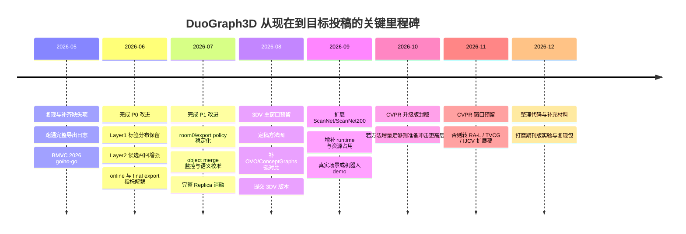

# DuoGraph3D 室内场景重建工作深度研究报告

该工作本质上是一条以 ConceptGraphs 为参照、面向开放词汇室内对象级重建的系统增强管线。当前最有价值的贡献不在几何表示重写，而在 Layer1/Layer2 关联诊断、online memory 维护与 memory-dense adaptive label split；room1 已明显超过基线，但 room0 仍暴露出候选召回与导出策略不稳的问题。若补齐全场景实验、online 与 final export 解耦指标、candidate-missing 改进与更强写作故事线，适合优先冲 3DV/BMVC，再视增量决定是否冲击 CVPR/期刊。 fileciteturn0file0L3-L11 fileciteturn0file0L625-L746

## 文档信息与前置假设

从已上传文档可确认：当前工作明确对齐了 ConceptGraphs-style 工程链路，输入是 Replica 的 RGB-D 与 `gsa_detections_none` 检测，主线为“单帧 mask 过滤/3D 投影 → EvidenceBuilder → Layer1 同帧碎片修复 → Layer2 到 online memory 的关联 → object merge / denoise → geometry / memory / memory-dense 导出 → ConceptGraphs official eval”。文档还给出了关键门限、导出策略和 room0 / room1 的当前结果，因此可以对方法、瓶颈和投稿风险做比较扎实的判断。 fileciteturn0file0L17-L46 fileciteturn0file0L128-L231 fileciteturn0file0L462-L527 fileciteturn0file0L625-L746

基于文档，当前系统更像“**训练自由或弱训练依赖的对象级语义重建/关联系统**”，而不是端到端可学习的神经几何重建模型：文档只明确了检测输入、规则门限、匹配逻辑、导出与评测，但没有出现独立训练集规模、训练轮次、优化器、学习率日程、随机种子和硬件吞吐等关键信息。除非后续代码另有实现，否则更合理的默认假设是：**几何与语义 backbone 为冻结组件，当前创新主要来自关联、融合、导出和评测层**。 fileciteturn0file0L130-L171 fileciteturn0file0L201-L231

| 复现关键项 | 文档状态 | 建议的默认假设 | 对实验解释的影响 |
| --- | --- | --- | --- |
| 训练集规模 | 未指定 | 当前主系统不做端到端训练；若新增学习模块，先以 ScanNet train + 非测试 Replica 场景构造训练集 | 影响“是不是 learning-based 方法”的表述 |
| backbone 版本 | 未指定 | 默认沿用 ConceptGraphs 对齐设置；检测来自 `gsa_detections_none`，文本/视觉相似度来自现有 CLIP 类流程 | 影响可重复性与语义上限 |
| 相机位姿来源 | 未指定 | 默认使用与 Replica / ConceptGraphs 对齐的现成姿态 | 影响几何一致性与关联结论 |
| 计算资源与吞吐 | 未指定 | 默认单机单 GPU + CPU 后处理 | 影响“实时/在线”表述强度 |
| 完整评测子集 | 未完全列出 | 默认遵循 `eval_replica_semseg` 所采用的官方场景集合；room0/room1 只是已公开分析样本 | 影响统计显著性 |
| 完整代码 | 未上传，仅列文件索引 | 默认代码与文档一致；当前报告基于文档描述做方法学审阅 | 影响实现级核验深度 |

当前最值得在报告中先行强调的“开放问题”有三类：其一，**online memory object 与 final exported object 不一致**，因此 final mIoU 不能直接解释为关联层已经变“干净”；其二，**Layer1 的 majority-label collapse 仍在污染 online memory**；其三，**room0 的主要缺陷不像是精度崩坏，而更像 coverage/export policy 不稳**。这些判断都直接来自文档，且会深刻影响你后续如何构造论文故事线。 fileciteturn0file0L277-L289 fileciteturn0file0L436-L452 fileciteturn0file0L497-L527 fileciteturn0file0L663-L674 fileciteturn0file0L724-L746

## 相关工作清单与上传工作的定位

从领域谱系看，与你的工作直接相关的不是单一子方向，而是六条线索的交叉：**室内 RGB-D 重建、多视图重建、NeRF/3DGS-SLAM、语义/全景语义融合、开放词汇 3D 实例与场景图、布局/补全/后处理与基准**。3DV 的官方征稿范围明确覆盖了 SfM、SLAM、dense reconstruction、segmentation、neural rendering 等议题；CVPR 的征稿范围同样显式覆盖 multi-view / sensors、scene analysis and understanding、multimodal learning 与 robotics。也就是说，这个题目在学术上是成立的，关键不在“有没有领域入口”，而在“你把哪条主线讲清楚”。 citeturn15view0turn11view3

**几何、多视图与 neural mapping 代表工作**

| 工作 | 作者与年份 | 核心方法 | 关键贡献 | 资源与影响 |
| --- | --- | --- | --- | --- |
| KinectFusion | Newcombe / Izadi 等，2011 | TSDF 体素融合 + ICP 跟踪 | 奠定 RGB-D 室内实时重建经典范式；“先位姿、后融合”的工程基线 | 论文；经典实时 RGB-D 重建代表作 citeturn21search0turn21search6 |
| BundleFusion | Dai 等，2017 | 实时全局位姿优化 + 重新积分 | 在大场景里把全局一致性与高质量重建结合起来，强调回环与重积分价值 | 论文 / 代码 / 数据；SIGGRAPH 2017 citeturn20view3turn1search4 |
| COLMAP | Schönberger 等，2016 | SfM + MVS | 传统多视图重建标准工具链，常作为高质量几何先验/离线基线 | 论文 / 官方软件；CVPR 2016 + 长期社区基准 citeturn27search15turn27search7turn27search3 |
| MVSNet | Yao 等，2018 | 可微单应 warping + 3D cost volume | 把深度学习 MVS 标准化，为后续 many-view indoor geometry 打基础 | 论文 / 代码；ECCV 2018 citeturn27search0turn27search8turn27search4 |
| R-MVSNet | Yao 等，2019 | depth 方向 GRU 递归正则化 | 解决高分辨率 MVS 的内存可扩展性问题 | 论文 / 代码；CVPR 2019 citeturn27search1turn27search5turn27search4 |
| PatchmatchNet | Wang 等，2021 | 学习式 PatchMatch cascade | 显著降低 MVS 的内存与时间开销，更适合高分辨率与资源受限场景 | 论文 / 代码；CVPR 2021 Oral citeturn27search2turn27search6turn27search10 |
| NeuralRecon | Sun 等，2021 | 片段级 sparse TSDF + GRU fusion | 以神经 TSDF 方式从单目视频实时重建 coherent surface | 论文 / 代码；CVPR 2021 Oral / Best Paper Candidate citeturn20view0 |
| NICE-SLAM | Zhu / Peng 等，2022 | 分层特征网格 + 神经隐式 RGB-D SLAM | 解决 iMAP 类方法过平滑、难扩展的问题，适合大室内场景 | 论文 / 代码；CVPR 2022 citeturn20view1 |
| Co-SLAM | Wang 等，2023 | Hash grid + one-blob encoding + 全局 BA | 强调高频细节、场景补全与 10Hz 级实时神经 SLAM | 论文 / 代码；CVPR 2023 citeturn20view2 |
| SplaTAM | Keetha 等，2024 | 3D Gaussian Splatting + online tracking/mapping | 代表 3DGS-SLAM 新范式，强调高保真和快速渲染/优化 | 论文 / 代码；CVPR 2024 citeturn20view5turn18search2 |

**语义重建、开放词汇语义与对象图代表工作**

| 工作 | 作者与年份 | 核心方法 | 关键贡献 | 资源与影响 |
| --- | --- | --- | --- | --- |
| SemanticFusion | McCormac 等，2017 | CNN 语义分割 + ElasticFusion 融合 | 最早一批把多视图语义概率融合到 3D map 的实时系统 | 论文 / 代码；经典语义 SLAM 起点之一 citeturn4search8turn26search2 |
| MaskFusion | Rünz 等，2018 | 实时实例识别、跟踪和动态 RGB-D 重建 | 把 object-aware / dynamic scene 引入 RGB-D SLAM | 论文 / 代码；ISMAR 2018 方向代表 citeturn17search0turn17search4turn17search8 |
| PanopticFusion | Narita 等，2019 | panoptic 2D 预测 + 在线体素融合 + CRF 正则 | 同时处理 stuff / thing，兼顾语义与实例一致性，并输出标注网格/mesh | 论文；IROS 2019 citeturn4search2turn26search0turn26search4 |
| Kimera | Rosinol 等，2019/2020 | VIO + mesh reconstruction + semantic labeling | 把 metric-semantic mapping 做成完整开源系统，重视机器人可用性 | 论文 / 代码；ICRA 2020 citeturn26search1turn26search5 |
| Mask3D | Schult 等，2023 | Transformer 3D instance mask prediction | 3D 实例分割强基线，避免大量手工几何 grouping 超参 | 论文 / 代码；ICRA 2023 citeturn7search15turn7search11 |
| OpenScene | Peng 等，2023 | multi-view 2D feature fusion + 3D distillation + 2D/3D ensemble | 把开放词汇 dense 3D feature 学成 task-agnostic 3D 表示 | 论文 / 代码；CVPR 2023 citeturn19view3 |
| ConceptFusion | Jatavallabhula 等，2023 | zero-shot pixel-aligned features + 多模态 3D 融合 | 强调 open-set、多模态、长尾概念保持与空间推理 | 论文 / 代码；RSS 2023 方向标志性工作 citeturn19view1 |
| OpenMask3D | Takmaz 等，2023 | 类无关 3D 实例掩码 + CLIP 多视图特征聚合 | 代表开放词汇 3D instance segmentation，尤其适用于长尾类别 | 论文 / 代码；NeurIPS 2023 citeturn19view2 |
| ConceptGraphs | Gu 等，2024 | 2D foundation models 输出投影到 3D，做多视角对象关联，再生成 3D scene graph | 对你的工作最关键的直接参照系；从 RGB-D 序列构建 open-vocabulary object graph | 论文 / 代码；ICRA 2024 citeturn19view0turn23search2 |
| OVO | Martins 等，2024/2025 | open-vocabulary online 3D segment tracking + learned CLIP merging + loop closure | 强调在线开放词汇语义 SLAM 与回环优化衔接，是你工作极值得对比的近邻 | 论文 / 网站 / 代码；RA-L 2025 citeturn25search0turn24view0turn25search4 |

**布局估计、场景补全与后处理代表工作**

| 工作 | 作者与年份 | 核心方法 | 关键贡献 | 资源与影响 |
| --- | --- | --- | --- | --- |
| ScanComplete | Dai 等，2018 | fully-conv 3D CNN 对不完整扫描做 completion + semantic labeling | 把“几何补全 + 语义”作为同一问题处理，适合室内 scan completion 叙事 | 论文 / 代码；CVPR 2018 citeturn16search5turn16search9 |
| MonoScene | Cao / de Charette，2022 | 2D-3D 投影 + 3D context prior + 全局/局部损失 | 单目 3D semantic scene completion 代表，说明弱输入也可做语义占据推理 | 论文 / 项目 / 代码；CVPR 2022 citeturn16search3turn16search11turn16search15 |
| VoxFormer | Li 等，2023 | sparse voxel queries + masked autoencoder densification | camera-only 3D semantic scene completion 强基线 | 论文 / 代码；CVPR 2023 citeturn16search2turn16search6turn16search18 |
| LayoutNet | Zou 等，2018 | 单图布局元素预测 + Manhattan fitting | 布局估计经典方法，适合房间结构先验叙事 | 论文 / 代码；CVPR 2018 citeturn7search8turn7search0 |
| HorizonNet | Sun 等，2019 | 全景图 1D layout representation | 把全景布局估计做得更轻量、准确，适合室内 room prior | 项目 / 代码；CVPR 2019 citeturn3search2turn3search6turn3search18 |
| PlaneRCNN | Liu 等，2019 | 单图 plane detection + multi-view consistency refinement | 为室内大平面、墙面/地面/桌面重建提供强先验 | 论文 / 代码；CVPR 2019 citeturn7search1turn7search5turn7search17 |
| Total3DUnderstanding | Nie 等，2020 | 布局、物体姿态与 mesh 联合重建 | 是“室内场景整体理解”而非单纯语义分割的代表 | 论文 / 代码；CVPR 2020 citeturn7search6turn7search2turn7search10 |
| Screened Poisson Reconstruction | Kazhdan / Hoppe，2013 | 面向有法向点云的高质量 watertight surface reconstruction | 代表 mesh/point cloud 后处理传统强手段，适合最终表面美化/补洞 | 论文 / 代码；经典后处理方法 citeturn8search4turn8search20turn8search16 |

如果你把工作做成正式论文，建议至少围绕三类数据组织实验：**Replica** 适合对象级开放词汇建图与可控语义分析；**ScanNet / ScanNet200** 适合更大规模、更真实的室内语义与长尾类别验证；**Matterport3D** 适合强调大尺度室内泛化。若你后续引入 novel view synthesis、3DGS 或高保真几何对比，**ScanNet++** 也是非常好的补充。 citeturn4search3turn4search0turn3search1turn21search2turn21search17turn3search5turn3search16

从结构与技术路线看，我对上传工作的定位如下。

| 最近工作 | 相似之处 | 关键差异 | 我对定位的判断 |
| --- | --- | --- | --- |
| ConceptGraphs | 同样从 posed RGB-D + 2D foundation-model detections 出发，做 3D object-level 融合与 open-vocabulary 表达 | 你的系统显式加入 Layer1/Layer2 分层关联、online memory、memory-dense hybrid export 与 adaptive label split，并直接针对 ConceptGraphs-style semantic collapse 做修复 | **最接近**；本质上是“ConceptGraphs 的 online object memory / export 纠错强化版” fileciteturn0file0L130-L171 fileciteturn0file0L201-L231 fileciteturn0file0L497-L527 citeturn19view0turn23search2 |
| OVO | 都在做 online open-vocabulary semantic mapping，并关注与 SLAM pipeline 的衔接 | OVO 更强调 3D segment mapper、learned CLIP merging 与 loop-closure-aware full SLAM；你的工作更强调 object memory 关联与 export-time semantic repair | **近邻但不相同**；如果未来接入 loop closure、learned CLIP merge，你会更像 OVO 系列 citeturn25search0turn24view0 |
| OpenMask3D / ConceptFusion / OpenScene | 都使用 CLIP 与多视图语义聚合，目标是开放词汇 3D 语义/实例表达 | 这些方法更偏 dense feature field、3D mask/open-vocabulary segmentation；你的方法更偏 online object association 与 final map export | **语义近、系统位姿不同**；它们更像你的语义上限参照物，而不是最直接 pipeline 基线 citeturn19view2turn19view1turn19view3 |
| PanopticFusion / Kimera | 都重视在线语义图、实例/语义一致性与 map-level regularization | 它们多为 closed-set / robot-centric volumetric mapping；你的工作是 open-vocabulary object memory + scene-graph 取向 | **工程借鉴价值很高**；尤其适合借其 map regularization 和 evaluation 叙事 citeturn4search2turn26search1turn26search5 |
| NICE-SLAM / Co-SLAM / SplaTAM | 都是“在线建图与室内场景重建”的强基线 | 你当前不在重写几何表示，也不在联合优化 pose + geometry；主矛盾是 semantic association/export，不是 neural geometry fidelity | **不是同一竞争层面**；现在贸然重写成 NeRF/3DGS 不是最优 ROI fileciteturn0file0L696-L746 citeturn20view1turn20view2turn20view5 |

综合来看，上传工作的**优势**有四点：第一，问题拆解够清楚，Layer1 解决单帧碎片修复，Layer2 解决 current-to-memory association，诊断链路比多数 scene-graph 管线更透明；第二，memory-dense export 与 adaptive label split 很准确地抓住了 ConceptGraphs 类方法常见的 semantic collapse；第三，已经把一批高价值的 ConceptGraphs 工程技巧吸收进来；第四，room1 上 mIoU / recall / precision / F1 已对齐并超过基线。它的**局限**同样清楚：Layer1 提前 majority vote、geometry key 过粗、Layer2 剩余错误集中在 candidate missing / wrong object、room0 的 coverage/export 仍不稳、而且 final map 提升主要来自 export 修复而非 online memory 本体净化。 fileciteturn0file0L43-L46 fileciteturn0file0L277-L289 fileciteturn0file0L313-L391 fileciteturn0file0L499-L527 fileciteturn0file0L637-L711 fileciteturn0file0L771-L775

## 对上传工作的实现分析与可优化模块

按文档给出的实现，当前系统的关键默认值包括：class-agnostic `quant_key()` 使用 0.20 m 体素，`layer1_merge_threshold=0.9`，`association_threshold=1.7`，`object_merge_threshold=0.88`；输入侧还有 `MIN_MASK_PIXELS=300`、`MASK_CONF_THRESHOLD=0.95`、`MAX_POINTS_PER_OBS=160`、`MAX_POINTS_PER_OBJECT=4096` 等工程门限。主要瓶颈不是 point-overlap 或 residual absorption——文档明确指出这两类问题在 room1 已基本被压住——而是 **Layer1 的 majority-label collapse、Layer2 的 candidate missing / wrong object，以及 room0 的导出策略**。 fileciteturn0file0L69-L85 fileciteturn0file0L154-L171 fileciteturn0file0L277-L289 fileciteturn0file0L366-L392 fileciteturn0file0L696-L746

更重要的是，文档已经给出一条关键解释：**room1 final mIoU 的提升主要来自 memory-dense adaptive label split，而不是 Layer2 本体已经足够纯净**。这既是当前工作的亮点，也是论文叙事的风险点。优点是你已经找到一个真正起效的“修复器”；风险是如果不把“online memory purity”和“final export quality”拆开，评审很容易质疑你的改进只是后处理技巧，而不是在线关联能力提升。 fileciteturn0file0L616-L617 fileciteturn0file0L724-L743 fileciteturn0file0L771-L775

**优先级排序的改进建议**

| 优先级 | 模块 | 当前症状 | 具体改进方案 | 时间估计 | 预期收益 | 潜在风险 |
| --- | --- | --- | --- | --- | --- | --- |
| P0 | Layer1 语义载荷 | 同帧 merge 后只保留 majority label，minority class 被过早抹平 | 把 `CurrentObjectHypothesis` 从单标签改成 `label_distribution + per-label sub-payload`；导出时再决策，而不是 Layer1 即硬判 | 5–7 人天 | 提升 tail class mIoU、降低后续 memory 污染 | 结构更复杂，merge/debug 成本上升 |
| P0 | Layer2 候选召回 | 剩余 ID switch 主要来自 candidate missing / wrong object | 增加 top-k 候选预算；基于 centroid+feature 做 ANN 召回；把“miss 的前一帧正确候选”写入 hard-negative log | 7–10 人天 | 降低 raw ID switches，提升 recall 与 object continuity | 召回增大后可能引入更多错配 |
| P0 | Export policy | room0 forced memory-dense 不稳，F-mIoU 明显差 | 恢复并系统化 `auto` 策略；按 scene-level coverage / root entropy / class size 自适应选择 geometry vs memory-dense | 4–6 人天 | room0 大类别覆盖与 F-mIoU 显著改善 | 论文故事线更像混合系统而非单一方法 |
| P0 | 评测口径 | online memory 与 final export 混在一起讲 | 新增三套指标：memory-node purity、memory-dense purity、final postprocess mIoU；并让 GT monitor 对齐 final exported objects | 3–5 人天 | 显著增强论文说服力 | 工程量不大，但需要系统性重写实验表 |
| P1 | 语义校准 | 文档指出 low CLIP-margin 比例高、init semantic accuracy 不高 | 引入 margin-aware weighting、温度缩放、背景保留 crop 与 tri-crop descriptor；必要时做轻量 learned CLIP merge，思路可借鉴 OVO 与 OpenMask3D | 10–15 人天 | 提升 precision，减少 semantic flip | 训练型模块会提高复现门槛 |
| P1 | object merge / graph regularization | merge 降 fragmentation 但 canonical switch 可能升高 | 对 merge 增加 Bayesian label smoothing 或 graph-level CRF / consistency penalty；借鉴 PanopticFusion 的 map regularization 叙事 | 8–12 人天 | 减少 merge-induced switch，增强 object consistency | 可能增加运行时与调参难度 |
| P1 | geometry key 设计 | 0.20m class-agnostic cell 易把不同物体挤进同一个 key | 从“单 centroid voxel”改为“centroid voxel + bbox bin + height bin + PCA aspect bin”的复合 signature；同时 ablate 0.10/0.15/0.20m | 7–12 人天 | 降低 same-cell collision | key 过细会增加 fragmentation |
| P2 | 学习式候选重排 | 当前 candidate score 仍以规则特征为主 | 利用 GT monitor 自动生成正负样本，训练小型 reranker（MLP / XGBoost）对候选做二阶段打分 | 3–4 周 | 直接打击 candidate missing / wrong object | 需要更多数据、更多写作篇幅、更多复现成本 |
| P2 | 推理效率 | 当前后处理、点采样与导出仍较重 | 异步化 postprocess；采用 reservoir/voxel-hash point sampling；只对高熵 root 做 label split | 5–8 人天 | 更容易把“在线”说圆 | 速度收益依赖实现质量 |

上表中，**我最推荐的第一组合**是“Layer1 保留 label distribution + Layer2 候选召回加强 + export policy 恢复自适应 + 指标解耦”。这是因为文档已经证明：当前最大剩余误差集中在 candidate missing / wrong object，且 room0 的问题更像 coverage/export，而非进一步 tightening gate 就能解掉。相比之下，直接把系统改写成 NICE-SLAM / Co-SLAM / 3DGS-SLAM，不仅工程量大，而且并不正对当前主矛盾。 fileciteturn0file0L709-L731 citeturn20view1turn20view2turn20view5

在“对照成熟实现”的角度，最值得你吸收的不是大而全的神经几何框架，而是三种成熟思想。第一，**OpenMask3D / OpenScene / ConceptFusion 的多视图语义聚合都尽量避免过早 top-1 承诺**，这正对应你当前 Layer1 的 majority collapse。第二，**PanopticFusion / Kimera 把 map-level regularization 当成系统必要部件**，这正对应你 merge 后 canonical switch 上升的问题。第三，**OVO 已经证明在线开放词汇语义 SLAM 可以引入 learned CLIP merging 与 loop-closure-aware 更新**，这给你的下一步演化提供了非常直接的参照。 citeturn19view2turn19view1turn19view3turn4search2turn26search1turn25search0turn24view0

**建议的可复现实验设置**

| 实验轨道 | 数据与规模 | 建议设置 | 评估基准 |
| --- | --- | --- | --- |
| 训练自由主线 | 先跑 ConceptGraphs official Replica 子集；投稿前至少扩展到完整 Replica 多场景；若要证明泛化，再补 ScanNet / ScanNet200 | 固定检测输入和位姿，做 deterministic sweep；每组配置至少保留 per-scene raw log 与 export probe | official `eval_replica_semseg`、per-scene mIoU / mRecall / mPrecision / mF1 / F-mIoU + fragmentation / switch / coverage |
| 语义校准小模型 | 非测试 Replica 场景 + ScanNet train 场景，构造 object observation 样本 | Logistic / 2-layer MLP；lr 1e-4–3e-4，batch 512–2048，20–40 epochs，早停依据 val tail-mIoU | macro/tail mIoU、precision、entropy reduction |
| 候选 reranker | 由 GT monitor 自动生成 10^5 级 hypothesis-node 正负 pair | 128–256 hidden dim；focal loss 或 BCE + class balance；hard negative mining | candidate recall@k、association accuracy、ID switch rate |
| 若扩展到渲染/3DGS | ScanNet++ 或高质量 Replica 子集 | 仅在 P0/P1 稳定后再做，不建议先上 | novel-view PSNR/SSIM/LPIPS + 语义指标 |

上述数据建议有现实依据：Replica 自带高质量 mesh、语义和实例信息，适合做 object-centric 语义建图；ScanNet 提供大规模 RGB-D indoor benchmark；ScanNet200 则能把你的“长尾类别和开放词汇”故事做得更硬；Matterport3D 适合补充更大尺度泛化。 citeturn4search3turn4search0turn3search1turn21search2turn3search5

**建议的超参数扫描范围**

| 部分 | 建议扫描范围 | 说明 |
| --- | --- | --- |
| `VOXEL_SIZE` | 0.10 / 0.15 / 0.20 | 验证 geometry key collision 与 fragmentation 的折中 |
| `MIN_MASK_PIXELS` | 150 / 300 / 500 | 查看小物体 recall 与噪声 trade-off |
| `MASK_CONF_THRESHOLD` | 0.85 / 0.90 / 0.95 | 评估检测过滤是否过于保守 |
| `LOW_CLIP_MARGIN` | 0.02 / 0.03 / 0.05 / 0.08 | 建立 semantic confidence calibration 曲线 |
| `MAX_POINTS_PER_OBS` | 160 / 256 / 512 | 看 observation 几何充分性是否限制关联 |
| `MAX_POINTS_PER_OBJECT` | 4096 / 8192 / 16384 | 看 long-lived object 的几何覆盖损失 |
| `layer1_merge_threshold` | 0.80 / 0.90 / 1.00 | 量化碎片修复 vs 错合并 |
| `association_threshold` | 1.50 / 1.70 / 1.90 | 量化 recall vs precision |
| `object_merge_threshold` | 0.84 / 0.88 / 0.92 | 量化 merge 收益与 canonical switch 风险 |
| `CG_DBSCAN_EPS` | 0.05 / 0.10 / 0.15 | 量化后处理对 coverage 与 noise 的影响 |
| `MEMORY_DENSE_MIN_ROOT_SHARE` | 0.50 / 0.60 / 0.70 | 量化 split 激进度对 final semantics 的影响 |

**建议的消融设计**

| 消融主题 | 对照组 | 目标问题 |
| --- | --- | --- |
| Layer1 标签承诺 | majority label vs label distribution | 证明 online memory 污染是否来自早期过硬决策 |
| Layer2 召回预算 | top-k = 5 / 10 / 20 / 40 | 定位 candidate missing 的边际收益 |
| geometry key | class-agnostic coarse / finer / composite signature | 验证 same-cell collision 假设 |
| export 策略 | geometry / memory / memory-dense / auto | 解释 room0 与 room1 差异根源 |
| adaptive split | on / off + entropy threshold sweep | 证明 room1 提升的真正来源 |
| merge guard | semantic conflict guard on / off | 量化 merge-induced canonical switch |
| CLIP confidence | low-margin filter / weighting / calibration | 证明 semantic noise 是否是主瓶颈之一 |
| postprocess | CG-style denoise/filter/merge on / off | 区分“方法收益”与“后处理收益” |

如果你只想用最少成本得到**可投稿级别**结论，我建议实验顺序是：先做 `export strategy × Layer1 payload × Layer2 recall` 三维小网格，在 room0/room1 上找规律；一旦结论稳定，再扩展到完整 Replica；最后才补 ScanNet / ScanNet200。这样最符合当前文档暴露出来的误差结构。 fileciteturn0file0L736-L746

## 创新性判断与投稿策略

以资深 3D 室内场景重建研究者的标准，我会给这项工作如下判断。

| 维度 | 当前评价 | 依据 |
| --- | --- | --- |
| 新颖性 | 中等偏上 | Layer1/Layer2 分层关联、online memory、memory-dense hybrid export、adaptive label split 的组合具有辨识度；但大量基础构件继承自 ConceptGraphs / 语义 SLAM 常见范式 |
| 技术深度 | 中等 | 诊断链条比单纯“加阈值”更成熟；但尚未引入 learned association、loop closure-aware semantic update 或更强语义表示学习 |
| 实验充分性 | 中等偏低 | room1 优势明确，但 room0 未稳定；目前更像“深入 case study + parity engineering”，还不是“完整 benchmark 论文” |
| 实用性 | 高 | 使用现成检测和冻结特征，适合机器人/工程部署；如果补齐吞吐与鲁棒性指标，实用价值会很强 |
| 可发表性 | 有机会 | 当前更适合聚焦系统论文或 focused venue；若要冲更高层级，需要把“为什么不是单纯后处理 trick”讲透 |

这个评分的核心逻辑是：**你已经有一个可以讲的“方法故事”，但还没有一个足以无争议说服顶会评审的“证据体量”**。尤其当文档自己已经承认 room1 提升主要来自 adaptive label split，而不是 online memory 本身净化时，评审最可能问的就是：“这到底是 online association 的贡献，还是 export trick 的贡献？”如果你把这个问题主动拆开，并用新指标回答，你的论文可信度会大幅上升。 fileciteturn0file0L616-L617 fileciteturn0file0L637-L711 fileciteturn0file0L771-L775

**按难度分层的投稿建议**

| 难度层级 | 目标 | 适配理由 | 现阶段缺口 | 时间建议 |
| --- | --- | --- | --- | --- |
| 稳健冲刺 | BMVC 2026 | BMVC 2026 官方主题显式覆盖 3D from X、scene understanding、multimodal learning、systems；而且当前离截稿最近，适合系统型论文快速验证 | 必须在 5 月中旬前跑完完整实验框架、核心消融和写作定稿，否则容易变成“赶工稿” | 官方摘要截至 2026-05-22、论文截至 2026-05-29、通知 2026-08-07；建议 **5 月上旬做 go/no-go 决策** citeturn11view1turn11view2 |
| 最优学术匹配 | 3DV 2027 | 3DV 官方主题长期直接覆盖 reconstruction、SLAM、dense reconstruction、segmentation、neural rendering；比综合顶会更贴合你的问题结构 | 需要完整多场景结果、清晰的方法图、online vs export 解耦指标、与 OVO / ConceptGraphs 的强对比 | 官方 2027 截稿尚未发布；参考 3DV 2025 与 2026 均在 8 月截稿，建议把 **2026-08 作为主提交窗口预留** citeturn15view0turn15view1turn9search8 |
| 高难度顶会 | CVPR 2027 | CVPR 官方主题包含 multi-view/sensors、scene analysis、multimodal learning、robotics，题目完全在范围内 | 需要更强方法深度：至少增加 learned reranker / semantic calibration / 更强泛化与效率证据，否则像“优秀工程增强”而不是“顶会方法论文” | CVPR 2027 官方 CFP 未发布；CVF 已公布 2027 在 Seattle，参考 CVPR 2026 截稿在 11 月上中旬，建议 **2026-10 前完成最终版封版** citeturn10search19turn11view3 |
| 机器人优先 | RA-L 或 TRO | RA-L scope 强调 timely、innovative robotics application/system；若你突出“在线对象级开放词汇建图可服务机器人感知与规划”，非常匹配 | 需要补 runtime、系统鲁棒性、真实数据/机器人场景与更工程化叙事 | 适合作为 3DV/BMVC 之后的扩展版或独立系统稿 citeturn14search3turn13search2 |
| 图形系统优先 | TVCG | 若论文更强调 3D scene graph、交互式可视化、dense map representation 与 graphics/system aspect，TVCG 是合理出口 | 需要更强图形/可视化价值与系统展示 | 适合作为“方法 + 可视化系统”版本 citeturn14search1turn14search5 |
| 长文扩展 | IJCV / TPAMI | 两者都适合更完整、更广覆盖的室内重建长文；尤其当你把 ConceptGraphs/OVO 近邻工作一并纳入更系统的理论和实验叙事时 | 现在证据不足；没有完整 benchmark、泛化与更深方法学时，不建议直接首投 | 建议 conference 版本稳定后再做扩展长文 citeturn14search2turn14search0 |

我对具体策略的建议非常明确：**不要把 BMVC 2026、3DV 2027、CVPR 2027 看成一条连续上升线，而要把它们看成三种不同故事线。**  
如果 5 月前只能完成“系统梳理 + room0/room1 + 小规模补充”，那就把 BMVC 2026 当作“以系统诊断和 object-memory/export decomposition 为中心的中期论文”；如果能在夏天前补齐完整 Replica、关键消融、OVO/ConceptGraphs 强对比，那么 3DV 2027 是最佳主目标；如果还能再往前走一步，把 learned reranker/semantic calibration、跨数据集泛化与效率表做扎实，才值得考虑 CVPR 2027。这个分层比“盲冲顶会”更健康。 citeturn11view2turn15view0turn11view3

**提高接受概率必须补齐的实验与写作清单**

| 类型 | 必补项 | 为什么重要 |
| --- | --- | --- |
| 实验 | 完整 Replica 多场景结果，而不是只展示 room0/room1 | 否则评审会认为结论依赖个别场景 |
| 实验 | `geometry / memory / memory-dense / auto` 全对照 | 这是解释 room0 与 room1 差异的关键 |
| 实验 | Layer1 payload、Layer2 recall、adaptive split、merge guard 的系统消融 | 这是证明贡献来源的核心证据 |
| 实验 | online memory purity vs final export metrics 解耦 | 直接回答“是不是后处理 trick”的质疑 |
| 实验 | runtime、GPU/CPU 占用、object 数量增长曲线 | 没有效率数据，就很难把“online system”说圆 |
| 对比 | 必须新增 OVO / OpenFusion / ConceptGraphs 近邻对比讨论，哪怕有些只做定性或部分定量 | 这决定评审是否认可你的定位准确 |
| 写作 | 方法图必须一页讲清楚 Layer1、Layer2、memory、export 的信息流 | 当前方法真正复杂点在此，而不是公式 |
| 写作 | 在摘要与引言里主动承认“final export quality ≠ online memory purity” | 主动设定评审预期，减少负面解读 |
| 复现 | 公开配置、日志 schema、评测脚本与变量说明 | 这类系统论文非常吃 reproducibility |

## 里程碑时间线

BMVC 2026 的官方时间已明确；3DV 2027 和 CVPR 2027 的官方征稿尚未发布，但从 3DV 2025/2026 与 CVPR 2026 的官方节奏看，分别应预留 2026 年 8 月和 2026 年 11 月前后的提交窗口。因此最现实的时间管理方式，是把 **2026 年 5 月作为 BMVC go/no-go 点、2026 年 8 月作为 3DV 主窗口、2026 年 11 月作为 CVPR 升级窗口**。 citeturn11view1turn11view2turn15view1turn9search8turn11view3turn10search19

如果只能给一个最实用的结论：**现在最该做的不是继续拧 Layer2 阈值，而是把“语义载荷、候选召回、导出策略、指标口径”四件事补齐。** 做完之后，这个工作就会从“有趣的工程修补”变成“有清晰科学问题、可解释误差结构、可投稿的系统论文”。 fileciteturn0file0L736-L746